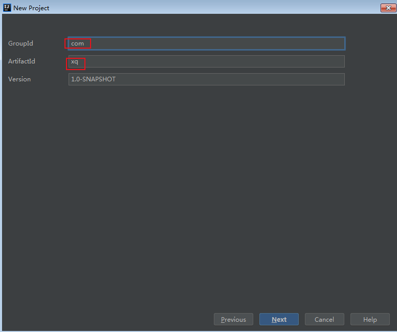

Android Studio 的编译构建，是基于Gradle的， 而Gradle又是基于Groovy， Groovy又是基于Java的。


# Groovy基本语法理论介绍

Gradle是一种基于Groovy语言(DSL)来声明的，所以我们很有必要先了解下Groovy 语言。Groovy 语言是用于Java虚拟机的敏捷语言，是可以用于面对对象编程，又可以用作纯粹的脚本语言，同时有具有闭包和动态语言的其他特性。

基本特性：
1. Groovy 完全兼容java语法
2. 末尾的分号是可选的
3. 类、方法默认是public的
4. 编译器会自动添加getter/setter方法
5. 属性可以用.号获取
6. 最后一个表达式的值会作为返回值的，return关键字可省略
7. ==等同于equals(),不会有NullPointerExceptions
8. 在Groovy中使用def关键字定义的变量类型都是Object，
定义方法时，通常可以省略def关键字，尽量别def和类型混用，避免这种写法def String name = "Guillaume"。def类似js中的var


高效特性
1. assert 断言语句 可以写在任何地方
2. 可选类型定义，相当于若类型语言 ，类型会自动推导出来的
3. 可选的括号 ，方法如过有有参数，（）可以不写
4. 字符串 有三种 分别为 ''  、 ""  、  '''  '''   ，引用${}
5. 闭包

# 参考：
[apache groovy官方文档](http://www.groovy-lang.org/documentation.html)
[Gradle DSL语法官方文档](https://docs.gradle.org/current/javadoc/)
[使用Groovy开发之新特性](https://www.jianshu.com/p/ba55dc163dfd)
[任玉刚：Gradle从入门到实战 - Groovy基础](https://blog.csdn.net/singwhatiwanna/article/details/76084580)
[刘望舒：Gradle核心思想（三）Groovy快速入门指南](https://blog.csdn.net/itachi85/article/details/84311537)
[Android构建02-Groovy基础](https://www.jianshu.com/p/158222e8035e/)
[Gradle系列之Groovy基础篇](https://juejin.im/post/5d14efc2e51d4510835e02d7?utm_source=gold_browser_extension)
[Android Gradle Groovy自动化构建入门篇](https://www.jianshu.com/p/20cdcb1bce1b)

# 报错：

```
* What went wrong:
Task 'hello' not found in root project 'MyTest'. 
Some candidates are: 'help'.

* Try:
Run gradle tasks to get a list of available tasks. 
Run with --stacktrace option to get the stack trace. 
Run with --info or --debug option to get more log output. 
Run with --scan to get full insights.
```
